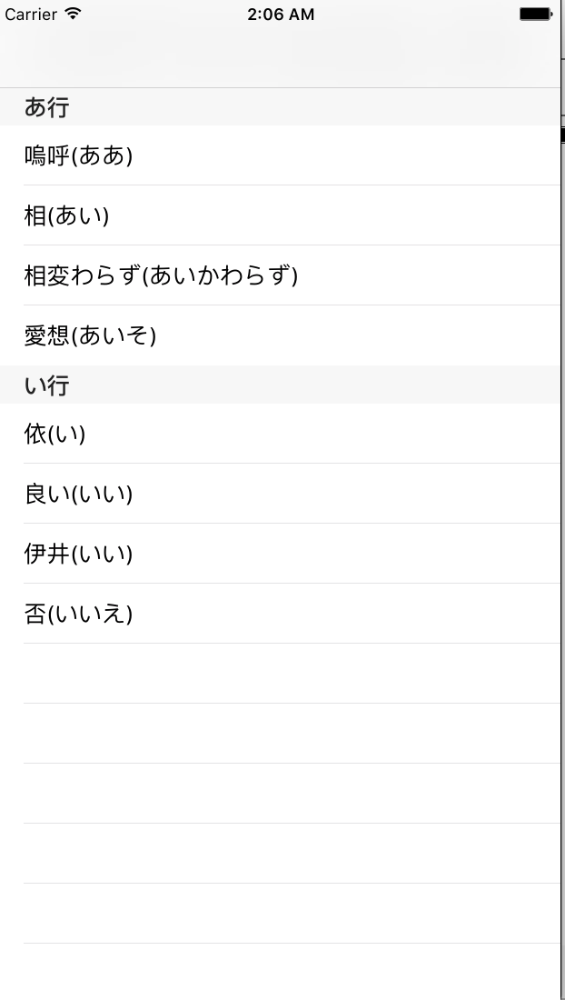
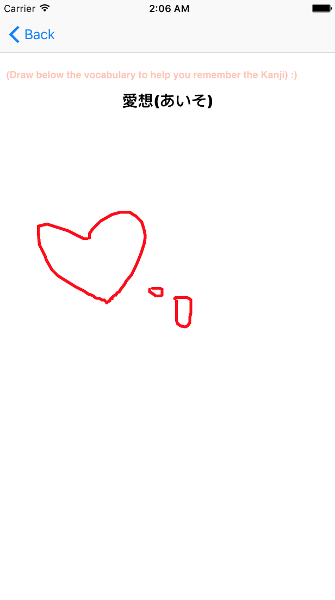

# IOSFinal

veryveryvery childlike Japanese vocabulary book

### functionality 
At least two view controllers that you implemented (container view controllers don’t
count).

One container view controller (tab bar, navigation view controller, split view, etc).

One custom view where you overload the drawRect method and add custom drawing.

At least one of the views must be laid out using AutoLayout

At least one animation.

### Screenshots
 
 

